# SmartHop

SmartHop is a last-mile shared ride platform for Mumbai Metro commuters. The project combines a Next.js frontend, a FastAPI-based ML service, Supabase-backed data flows, and map-driven rider and driver experiences.

Live demo: [https://smarthop.vercel.app](https://smarthop.vercel.app)

## Overview

The platform is organized as a small monorepo:

- `smarthop/` - Next.js application for riders, drivers, and admins
- `ml-service/` - Python FastAPI service for fare prediction, ride clustering, route optimization, and driver ranking
- `ml/models/` - Pre-trained ML artifacts used by the backend
- `ml-service/migrations/` - Database and backend migration scripts

## Key Features

- Rider onboarding, shared ride requests, fare summaries, and live trip tracking
- Driver dashboard with online/offline control, ride acceptance, routing, and earnings visibility
- Admin screens for analytics and ML performance monitoring
- Map-based flows for Mumbai Metro stations and route visualization
- ML-assisted matching and pricing through a dedicated inference service

## Tech Stack

- Frontend: Next.js 16, React 19, TypeScript, Tailwind CSS v4, Framer Motion
- UI: shadcn/ui, Radix primitives, Sonner, Lucide icons
- Backend: Supabase, FastAPI, Uvicorn
- ML: scikit-learn, pandas, NumPy, Joblib
- Maps: Mapbox and map components for route and station experiences

## Local Development

### Frontend

```bash
cd smarthop
npm install
npm run dev
```

### ML Service

```bash
cd ml-service
python -m venv venv
.\venv\Scripts\activate
pip install -r requirements.txt
uvicorn main:app --reload
```

## Environment Variables

Set these values in `smarthop/.env.local`:

```bash
NEXT_PUBLIC_SUPABASE_URL=
NEXT_PUBLIC_SUPABASE_ANON_KEY=
NEXT_PUBLIC_MAPBOX_ACCESS_TOKEN=
NEXT_PUBLIC_ML_SERVICE_URL=
```

## Screenshots

Add your screenshots in `smarthop/public/ss/`.

### Landing / Signup


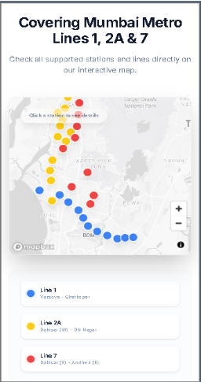
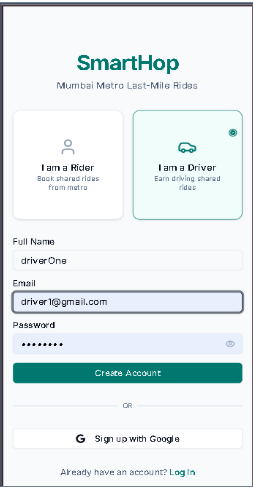

### Rider Flow

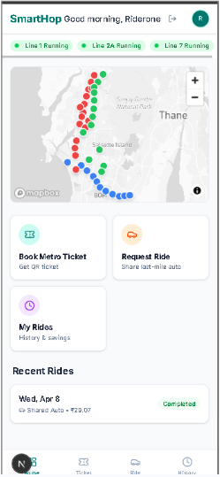
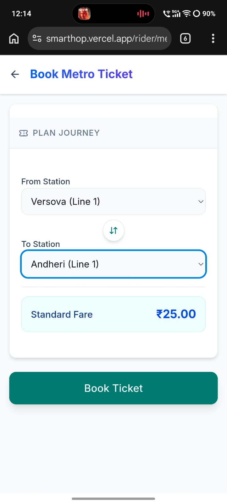
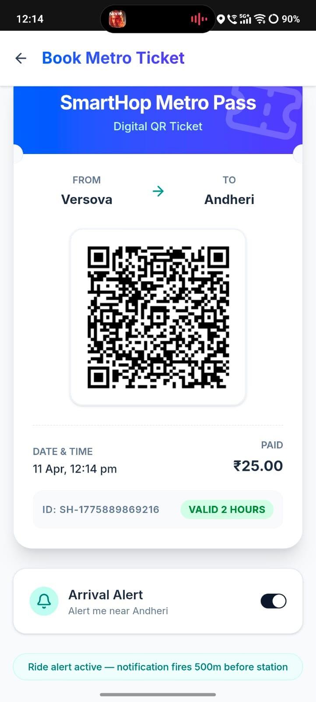
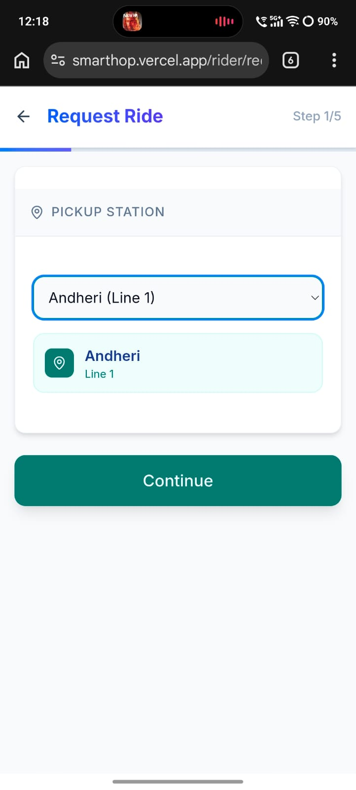
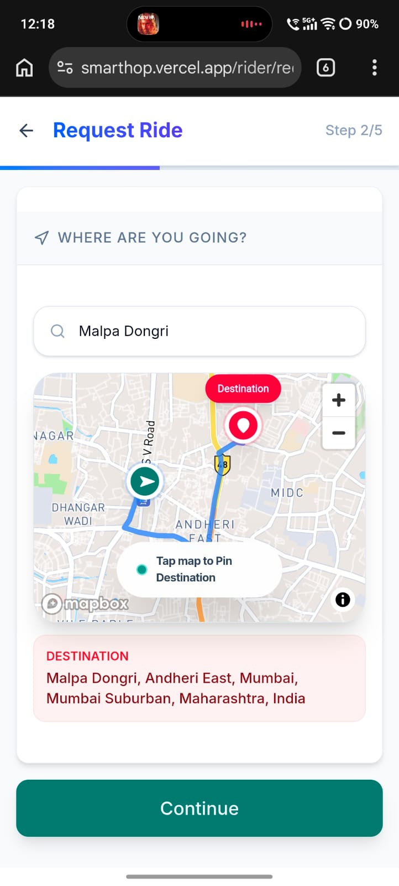
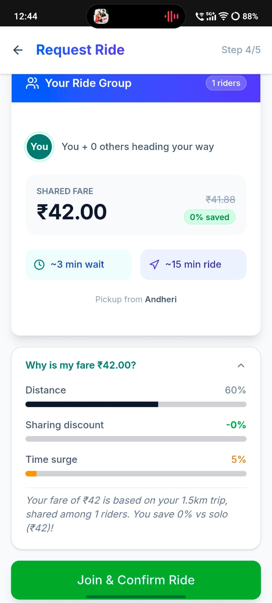
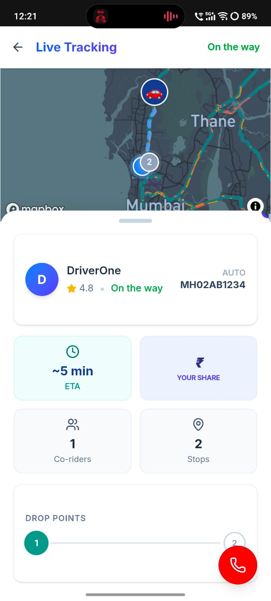
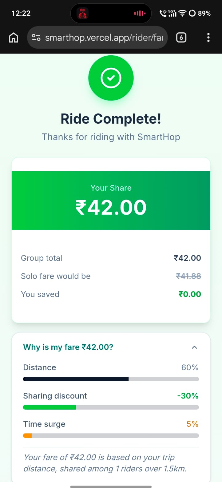

### Driver Flow

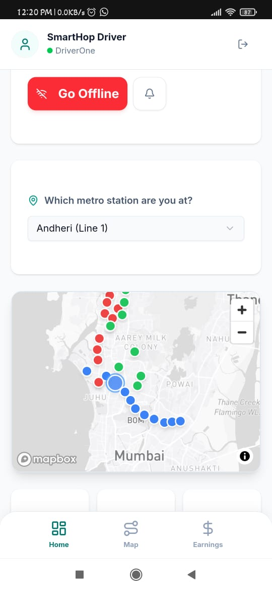
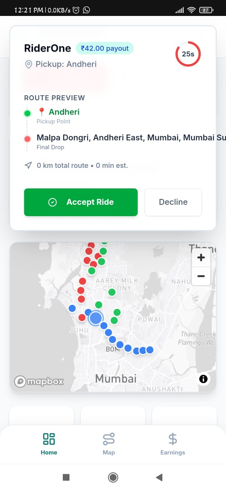
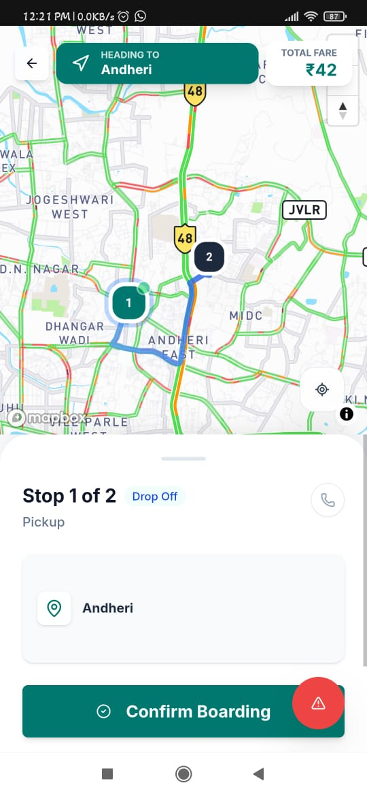
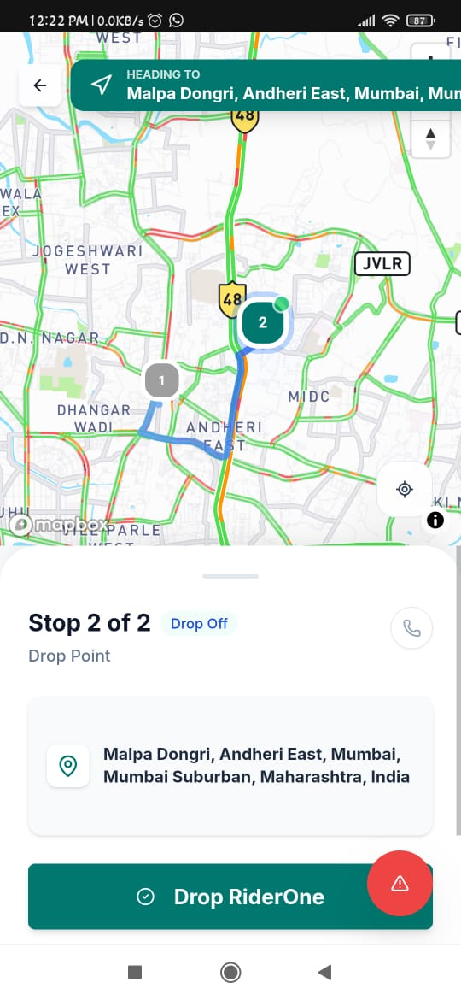
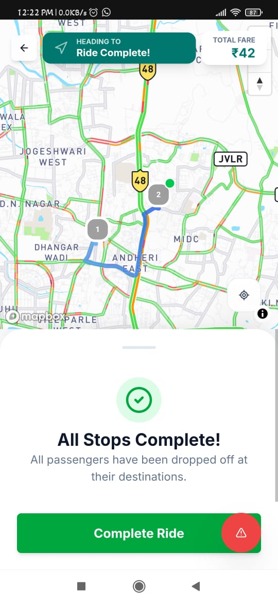
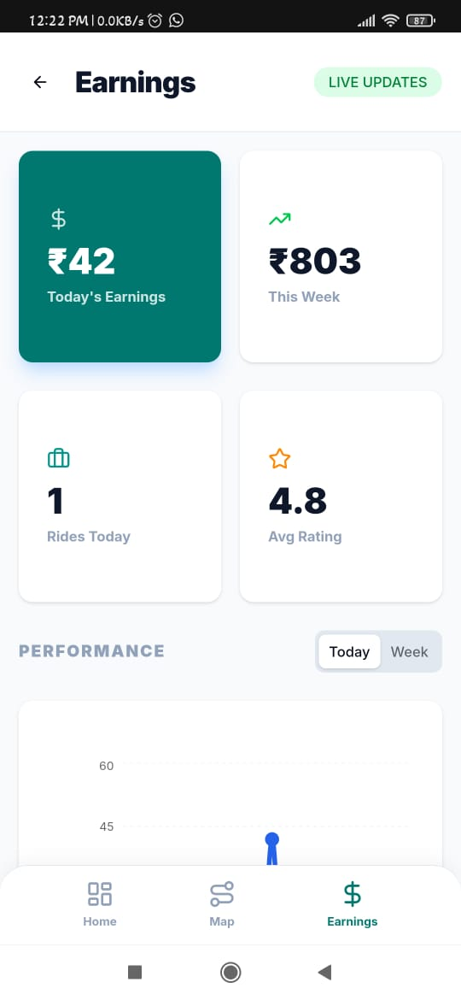

## Deployment

The frontend is deployed on Vercel at [smarthop.vercel.app](https://smarthop.vercel.app).

The ML service should be deployed separately and the frontend should point to it through `NEXT_PUBLIC_ML_SERVICE_URL`.

## Notes

- The ML service loads pre-trained `.joblib` files on startup.
- Supabase and Mapbox credentials are required for the frontend to work correctly.
- The app includes both user-facing ride flows and operational/admin views.